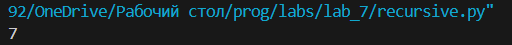
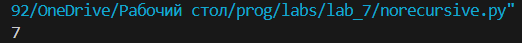
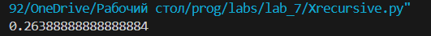
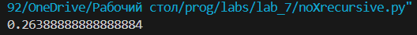

# Лабораторная работа №7
## Вариант 1
### Ход работы
1. Напишите две функции для решения задач своего варианта - с использованием рекурсии и без.
2. Оформите отчёт в README.md. Отчёт должен содержать:
3. Условия задач
4. Описание проделанной работы
5. Скриншоты результатов
6. Ссылки на используемые материалы
### Задание 
1. **Функция для подсчёта числа элементов в списках, включая вложенные списки**  
```
>>> count([])
0
>>> count([1, 2, 3])
3
>>> count(["x", "y", ["z"]])
4
>>> count([1, 2, [3, 4, [5]]])
7
```
2. **Функция для расчёта**  $x_i = \frac{(i-1) x_{i-1}}{3} + \frac{(i-2) x_{i-2}}{4}, \; x_1 = 1, \; x_2 = -\frac{1}{8}$
### Код 1
1. С рекурсией 
```
def count(lst):
    n = 0
    for element in lst:
        if isinstance(element,list):  # Если элемент — это список
            n += count(element)
            n+=1
        else:
            n += 1 
    return n
print(count([1, 2, [3, 4, [5]]]))
```
  

2. Без рекурсии
```
def count(lst):
    n = 0
    stack = lst
    while stack:
        st = stack.pop()
        if isinstance(st, list):
            stack.extend(st)
            n+=1
        else:
            n+=1
    return n
print(count([1, 2, [3, 4, [5]]]))
```
  

### Код 2
1. С рекурсией
```
def x(i):
    if i == 1:
        return 1
    if i == 2:
        return -1/ 8
    return ((i - 1) * x(i - 1)) / 3 + ((i - 2) * x(i - 2)) / 4
print(x(5))
```


2. Без рекурсии
```
def x(i):
    if i == 1:
        return 1
    if i == 2:
        return -1 / 8
    x2 = 1  # x_1
    x1 = -(1 / 8)  # x_2
    for i in range(3, i + 1):
        xi = ((i - 1) * x1) / 3 + ((i - 2) * x2) / 4
        x2 = x1
        x1 = xi
    return xi
print(x(5))
```
